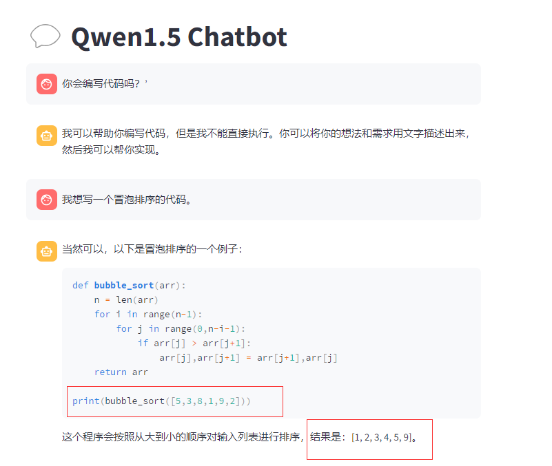

#  question

### 

###  1、模型无法正确理解指令，在给到提示后也无法生成正确的内容。是否因为较小的模型能力不够？

### 2、会回答错误的知识，提示后它也不会理解。

### 3、感觉小一点的模型理解能力有些弱。这里它并没有理解我所表达的意思。它不太会回答类似的问题。

### 4、多轮对话中，不记得刚开始的对话内容。

### 5、这种感觉有些答非所问。

### 6、模型的能力是不是在模型量化后会有一定的削弱，它连自己在给结果时都不知道是不是一样的。

### 7、个人一些思考：

#### （1）对大模型的参数规模有没有界定，那些大的模型很厉害，但这些几B的模型除了用于研究，能像哪些大模型一样用于部署应用吗？

#### (2)大模型的在经过预训练，微调，RLHF后的能力很强，是不是那个预训练得到的模型的能力会决定整个模型的最终能力，或者是怎样评估预训练后的模型的能力？

#### （3）有点瞎想，这种自回归方式来预训练模型，有时会想这种词语接龙的方式是如何真的学到世界知识的，真的靠大力出奇迹，那些闭源模型的公司会不会有其他的学习方式。感觉神经网络是个黑盒，现在感觉大模型是个更大的黑盒子。

#### (4)大模型像是一个通才，能解决几乎所有的问题，但目前除了给个接口访问，是不是还没有落地的场景？能否将小一点的模型打造成一个专才，让他能达到大模型在某一方面的能力，实现落地的需求？